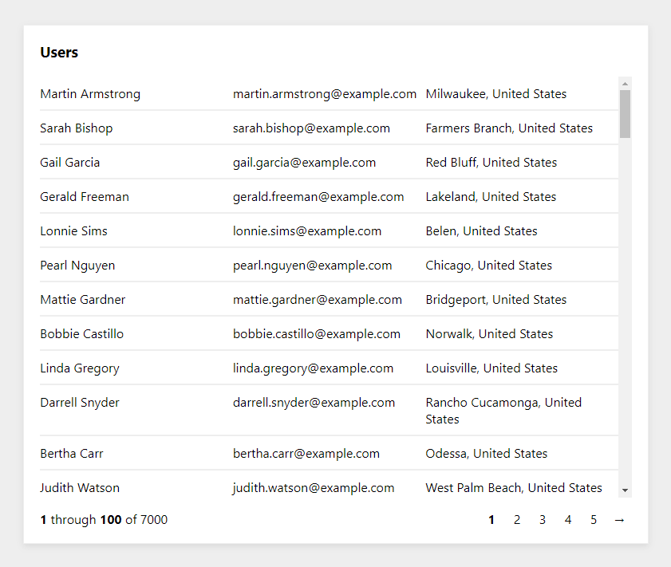

# React User Data Demo

This repo demonstrates how React.js can be used to efficiently fetch and display large quantities of data from an Express.js server.

The express server loads 7,000 user records from randomuser.me and parses them for quick and repeated access, as if they were stored in a local database. The saved data is exposed through an API that allows the following actions:

- Get one page of the user data with only a subset of fields.
- Get the entire record for one user by providing the user's ID.

The React frontend displays a table of user data, with pagination controls. The state holds only the list data for the users of the current page, and requests a new page of data each time the page changes.

When a row from the table is clicked, the app requests the full User data from the server to display in a separate User Profile view.
